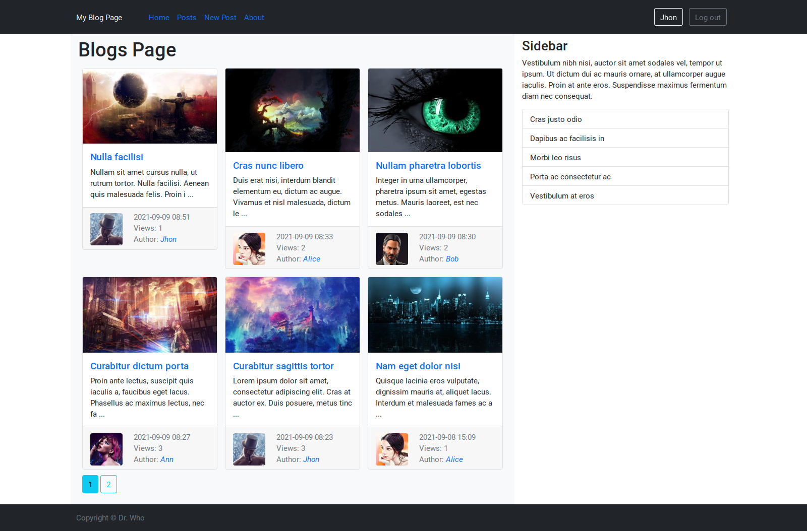

# Simple blog app
Written in Python with Flask, PostgreSQL, Bootstrap

## Main features
- User registration, authorization
- Confirmation and password reset by email
- Edit user profile
- Create, edit, delete posts, pagination
- Views counter for posts
- Auto set site language
- Base API for request data in JSON

